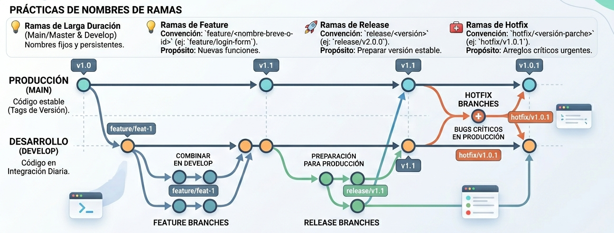

  

# 📍 LogiTrack - Sistema de Monitoreo en Tiempo Real

Plataforma de rastreo vehicular en tiempo real. Este proyecto utiliza WebSockets para la transmisión de coordenadas y una base de datos espacial para el almacenamiento de rutas.

## Arquitectura
* **Backend:** Node.js + Express
* **Tiempo Real:** Socket.io
* **Base de Datos:** PostgreSQL + PostGIS (vía Docker)

---

## Requisitos Previos
Antes de empezar, asegúrate de tener instalado en tu PC:
1. Node.js (Versión LTS recomendada)
2. Docker Desktop (Debe estar abierto y corriendo)
3. Git

---

## Pasos para levantar el entorno local

### 1. Clonar el repositorio
Abre tu terminal y ejecuta:
//git clone https://github.com/Chopan22/Logitrack.git
//cd Logitrack

### 2. Levantar la Base de Datos (Docker)
El motor principal está en la carpeta del backend.
//cd backend
//docker-compose up -d

### 3. Configurar y encender el Backend
Sin salir de la carpeta backend, instala las dependencias:
//npm install

Crea un archivo llamado .env en la raíz de la carpeta backend. Copia el contenido que está en el archivo .env.example y pégalo ahí. Recuerda cambiar la contraseña de la base de datos por la que sale en el archivo docker-compose.yml.

Arranca el servidor:
//npm run dev

---

## ¿Cómo simular datos (Prueba rápida)?
Para no depender del hardware GPS mientras programamos, hay un simulador integrado:
1. Ve a la carpeta backend.
2. Haz doble clic en el archivo cliente-prueba.html (se abrirá en tu navegador).
3. Presiona el botón "Enviar Ubicación GPS Falsa".
4. En tu terminal (donde está corriendo el backend) verás instantáneamente cómo el servidor recibe y registra las coordenadas gracias a los WebSockets.

  

