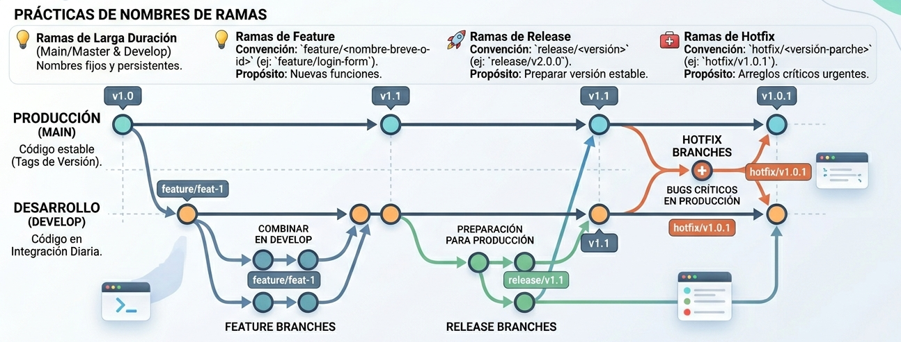

# LogiTrack — Sistema de Gestión y Trazabilidad de Última Milla

Plataforma integral (web + móvil) para la logística de entrega de última milla. Los repartidores transmiten su ubicación GPS en tiempo real vía WebSocket; el backend la persiste en PostgreSQL/PostGIS y la re-transmite al panel de administración y a los clientes, que siguen su pedido en un mapa en vivo.

## Vistas del sistema

| Vista | Plataforma | Descripción |
|-------|-----------|-------------|
| **Repartidor** | App móvil (Expo / React Native) | Login, gestión de rutas, envío de GPS en vivo, ruta por calles, gestión de pedidos asignados. |
| **Cliente** | App móvil (Expo, público sin login) | Sigue un pedido por su número: ubicación del repartidor en tiempo real, estado y tiempo estimado de llegada. |
| **Administrador** | Panel web (Next.js) | Gestión de pedidos, rutas, flota (vehículos/conductores) y mapa general en vivo de todos los repartidores. |

## Arquitectura

```
   App Repartidor (Expo) ──┐                          ┌── Panel Admin (Next.js)
                           ├─→ Backend (Express + Socket.io) ─┤
   App Cliente (Expo) ─────┘            │                     └── (mapa Leaflet en vivo)
                                  PostgreSQL + PostGIS
```

**Stack:**
- Backend: Node.js + Express 5, Socket.io, JWT (autenticación)
- Base de datos: PostgreSQL 15 + PostGIS 3.3 (Docker)
- App móvil: Expo SDK 54, Expo Router, react-native-maps, expo-location
- Panel web: Next.js 16, React 19, Tailwind CSS 4, Leaflet
- Geocodificación: Google Geocoding API (con fallback a Nominatim/OSM)
- Ruteo por calles: OSRM (servidor público)
- Gestor de paquetes: npm (raíz y backend) + pnpm (frontend-web)

---

## Estructura del repositorio

```
Logitrack/
├── backend/        API REST + WebSocket + migraciones
├── app-movil/      App Expo (vistas Repartidor y Cliente)
├── frontend-web/   Panel de administración (Next.js)
├── package.json    Scripts de arranque concurrente (raíz)
└── docker-compose.yml
```

Cada subproyecto tiene su propio README con detalles:
- [`app-movil/README.md`](app-movil/README.md) — app del repartidor y cliente.
- `frontend-web` — panel admin (instrucciones abajo).

---

## Modelo de Datos

```
usuarios (auth)        vehiculos     conductores
                           │              │
                           └──────┬───────┘
                                  ▼
                                rutas
                          ┌───────┴───────┐
                          ▼               ▼
                    ubicaciones        pedidos
                  (GPS en vivo)   (entregas + destino geo)
```

| Tabla | Descripción |
|-------|-------------|
| `usuarios` | Acceso y roles (admin / repartidor). Contraseñas con bcrypt. |
| `vehiculos` | Flota de vehículos (patente, alias, tipo). |
| `conductores` | Conductores activos. |
| `rutas` | Sesión de trabajo: vehículo + conductor + período. |
| `ubicaciones` | Puntos GPS (PostGIS) asociados a una ruta activa. |
| `pedidos` | Entregas con destino geográfico (PostGIS), cliente y estado. |

---

## Requisitos Previos

- [Node.js](https://nodejs.org/) (LTS)
- [Docker Desktop](https://www.docker.com/products/docker-desktop/)
- [Expo Go](https://expo.dev/go) en tu celular (para probar la app móvil)
- Git

---

## Levantar el entorno local

### 1. Clonar e instalar dependencias

```bash
git clone https://github.com/Chopan22/Logitrack.git
cd Logitrack
npm install
cd frontend-web && pnpm install && cd ..
cd backend && npm install && cd ..
```

### 2. Base de datos

> El contenedor expone PostgreSQL en el **puerto 5433** del host (`5433:5432`) para no chocar con un PostgreSQL nativo que use el 5432.

### 3. Backend

```bash
cd backend
cp .env.example .env
```

Edita `.env` (coincide con `docker-compose.yml`):

```env
PORT=3000
DB_USER=logitrack_admin
DB_PASSWORD=superpassword123
DB_HOST=127.0.0.1
DB_PORT=5433
DB_NAME=logitrack_dev
JWT_SECRET=una_clave_segura
# Opcional: geocodificación precisa con Google. Si se deja vacío, usa Nominatim (OSM).
GOOGLE_MAPS_API_KEY=
```

Corre migraciones y arranca:

```bash
node scripts/migrate.js
npm run dev      # http://localhost:3000
```

### 4. App móvil (Repartidor + Cliente)

```bash
cd app-movil
npm install
```

Configura la IP de tu PC en `app.json` → `expo.extra.apiUrl` (Expo Go en celular **no** usa `localhost`, sino la IP de tu red local, ej. `http://192.168.1.100:3000`). Luego:

```bash
npx expo start
```

Escanea el QR con Expo Go. Más detalles en [`app-movil/README.md`](app-movil/README.md).

### 5. Panel de administración (web)

```bash
cd frontend-web
pnpm dev      # http://localhost:4000
```

Corre en el **puerto 4000** para no chocar con el backend (3000). La URL del backend se configura en `frontend-web/.env.local` (`NEXT_PUBLIC_API_URL`).

### Crear un usuario admin de prueba

```bash
curl -X POST http://localhost:3000/api/auth/registro \
  -H "Content-Type: application/json" \
  -d '{"nombre":"Admin","email":"admin@logitrack.cl","password":"123456","rol":"admin"}'
```

---

## Arranque rápido (un solo comando)

Para levantar **base de datos + backend + frontend** juntos desde la raíz del repositorio:

```bash
npm run dev
```

Este comando (definido en el `package.json` raíz) levanta automáticamente:
1. La base de datos PostgreSQL vía Docker Compose (hook `predev`)
2. El backend (`http://localhost:3000`)
3. El panel web (puerto Next.js)

Los logs de cada servicio aparecen con prefijo de color (`backend` en cyan, `frontend` en magenta). La app móvil se levanta aparte con Expo (paso 4).

---

## API REST

### Autenticación

| Método | Endpoint | Body | Descripción |
|--------|----------|------|-------------|
| POST | `/api/auth/registro` | `{ nombre, email, password, rol? }` | Crear usuario |
| POST | `/api/auth/login` | `{ email, password }` | Devuelve `{ token, usuario }` |

### Vehículos

| Método | Endpoint | Body |
|--------|----------|------|
| GET | `/api/vehiculos` | — |
| POST | `/api/vehiculos` | `{ patente, alias?, tipo? }` |
| PATCH | `/api/vehiculos/:id` | `{ alias?, tipo?, activo? }` |

### Conductores

| Método | Endpoint | Body |
|--------|----------|------|
| GET | `/api/conductores` | — |
| POST | `/api/conductores` | `{ nombre, telefono? }` |
| PATCH | `/api/conductores/:id` | `{ nombre?, telefono?, activo? }` |

### Rutas

| Método | Endpoint | Body |
|--------|----------|------|
| GET | `/api/rutas` | — (acepta `?estado=en_curso`) |
| POST | `/api/rutas` | `{ vehiculo_id, conductor_id }` |
| PATCH | `/api/rutas/:id/cerrar` | — |

### Pedidos (requieren JWT, salvo el tracking público)

| Método | Endpoint | Body / Notas |
|--------|----------|--------------|
| GET | `/api/pedidos` | Lista (acepta `?estado=` y `?ruta_id=`). Incluye `lat`/`lng` del destino. |
| POST | `/api/pedidos` | `{ direccion_destino, descripcion?, cliente_nombre?, cliente_telefono?, lat?, lng? }`. Si no se envían `lat`/`lng`, se **geocodifica** la dirección automáticamente. |
| PATCH | `/api/pedidos/:id` | `{ estado? }` |
| PATCH | `/api/pedidos/:id/asignar` | `{ ruta_id }` → estado `en_camino` |
| GET | `/api/pedidos/:id/tracking` | **Público** (sin login). Estado del pedido + última ubicación del repartidor. Usado por la vista del cliente. |

---

## WebSocket

Conexión: `ws://localhost:3000`

**`enviar_ubicacion`** (cliente → servidor): envía GPS de una ruta activa.
```json
{ "ruta_id": 1, "lat": -33.4569, "lng": -70.6483 }
```

**`nueva_ubicacion`** (servidor → todos): re-transmite cada ubicación recibida.
```json
{ "ruta_id": 1, "lat": -33.4569, "lng": -70.6483 }
```

---

## Geocodificación

Al crear un pedido sin coordenadas, el backend convierte la dirección en `lat`/`lng`:
1. **Google Geocoding API** si `GOOGLE_MAPS_API_KEY` está configurada (precisión alta en Chile; requiere facturación habilitada).
2. **Nominatim (OpenStreetMap)** como fallback gratuito si no hay key o Google falla.

---

## Estado del proyecto

**Implementado:** las tres vistas (repartidor, cliente, admin), tiempo real con WebSockets, datos geográficos con PostGIS, geocodificación de direcciones, ruta por calles (OSRM) con distancia/ETA, y mapa general en vivo.

**Pendiente (trabajo futuro):**
- Optimización de rutas multi-parada (VRP) y persistencia del `Optimized_Path`.
- Geofencing: notificaciones automáticas por proximidad al destino.
- Sincronización offline del repartidor.
- Proteger con autenticación los endpoints de vehículos/conductores/rutas (hoy solo `pedidos` exige JWT).

---

## Migraciones

Viven en `backend/migrations/` y se aplican en orden numérico:

```bash
node scripts/migrate.js
```

El sistema registra las aplicadas en la tabla `_migraciones`, por lo que es seguro correrlo varias veces.

---

## Git Flow

```
main        (producción)
  └── develop  (integración)
        └── feat/nombre-feature  (trabajo activo)
```

```bash
git checkout develop
git checkout -b feat/nombre-de-lo-que-vas-a-hacer
```

<p align="center">
  
</p>
